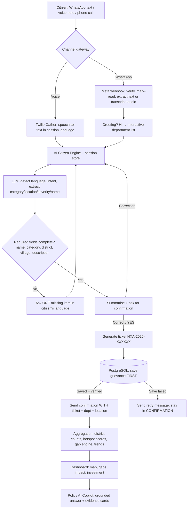
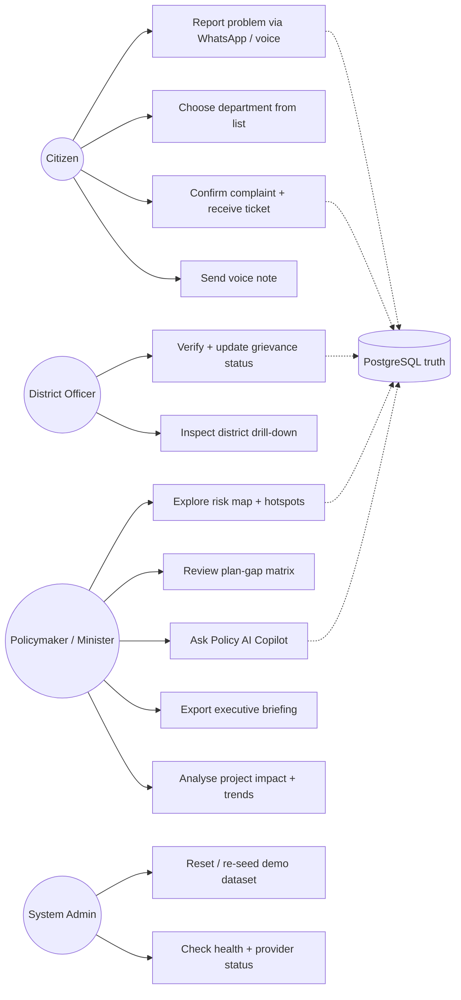
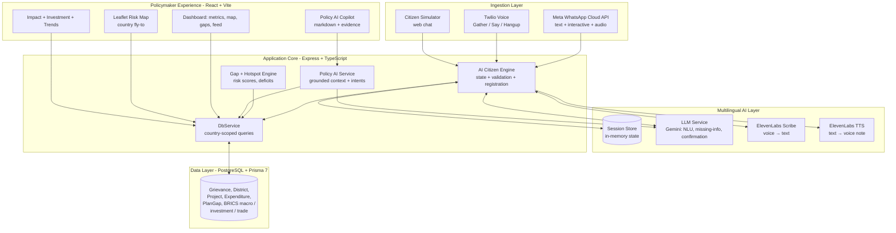

# Nexa — BRICS AI for Digital Public Infrastructure & Governance

> A scalable, multilingual AI platform — designed as a **Digital Public Good** — that turns everyday citizen voices on **WhatsApp and phone calls** into decision-grade development intelligence for policymakers.


---

## Table of Contents

1. [Brief About the Solution](#1-brief-about-the-solution)
2. [The Problem](#2-the-problem)
3. [The Challenge](#3-the-challenge)
4. [How Nexa Is Different From Existing Ideas](#4-how-nexa-is-different-from-existing-ideas)
5. [How Nexa Solves the Problem](#5-how-nexa-solves-the-problem)
6. [List of Features Offered by the Solution](#6-list-of-features-offered-by-the-solution)
7. [Process Flow Diagram](#7-process-flow-diagram)
8. [Use-Case Diagram](#8-use-case-diagram)
9. [Wireframes / Mock Diagrams of the Proposed Solution](#9-wireframes--mock-diagrams-of-the-proposed-solution)
10. [Architecture Diagram of the Proposed Solution](#10-architecture-diagram-of-the-proposed-solution)
11. [Technologies Used in the Solution](#11-technologies-used-in-the-solution)
12. [Repository Structure](#12-repository-structure)
13. [Getting Started (Run the MVP End-to-End)](#13-getting-started-run-the-mvp-end-to-end)
14. [Demo Script (5-Minute Hackathon Demo)](#14-demo-script-5-minute-hackathon-demo)
15. [Data & AI Grounding Strategy](#15-data--ai-grounding-strategy)
16. [Roadmap](#16-roadmap)
17. [Limitations & Assumptions](#17-limitations--assumptions)

---

## 1. Brief About the Solution

**Nexa** is a production-style hackathon MVP for the BRICS Track-1 challenge: *"scalable, multilingual AI for Digital Public Infrastructure & Governance."*

A citizen reports a problem **naturally** — a WhatsApp text, a WhatsApp voice note, or a phone call, in Hindi, Hinglish, Tamil, Bengali, Telugu, Marathi, Gujarati, Kannada, Malayalam, Punjabi, Urdu, English, Portuguese, Russian or Chinese:

> "Mere gaon mein 3 hafte se paani nahi aa raha."

Nexa:

1. **Understands** the complaint (multilingual LLM layer — language detection, category, location, severity, missing-info detection).
2. **Converses** — remembers session state, asks only for what is genuinely missing (name, district, village/ward, description), confirms, then **registers the grievance in PostgreSQL with an immediate reference number** sent directly to the citizen.
3. **Aggregates** every grievance with demographic data, infrastructure baselines, public investment/projects, expenditure ledgers, and BRICS macro/investment/trade datasets.
4. **Surfaces intelligence** on a premium policymaker dashboard: interactive risk map, demand hotspots, infrastructure gaps, current-plan gap analysis, project-impact analytics, trends, and a **grounded Policy AI Copilot** that answers questions like *"Which districts have high demand but no corresponding project?"* strictly from real database evidence.

Core design principles:

- **AI at every layer, but never hallucinating governance facts.** Analytical numbers always come from the database; the AI explains the evidence.
- **Provider/model agnostic.** Gemini today, any LLM/STT/TTS tomorrow via clean service abstractions (`LlmService`, `ElevenLabsService`, `TwilioService`, `WhatsAppService`).
- **Country-agnostic architecture, India-first demo data.** Geography, currency, language and BRICS enums are configurable; the seed focuses on India plus reference profiles for all 11 BRICS nations.
- **Real-time, no heavy infra.** In-memory conversation state, direct request processing (no queues/workers/Kafka in the prototype), PostgreSQL as the persistent source of truth.

---

## 2. The Problem

Governments across India struggle to **consolidate citizen feedback and align it with national infrastructure priorities**.

- Development requests live in **fragmented systems** (helplines, registers, portals, paper).
- This leads to **misaligned public spending**, **unaddressed infrastructure gaps**, and **no way to measure the impact** of large-scale digital public infrastructure initiatives.
- Linguistic diversity makes it worse: a farmer in Bahraich, a teacher in Murshidabad and a health worker in Gadchiroli cannot all use the same English form.
- Policymakers get anecdotes, not evidence: *where is demand rising fastest? Which plan covers it? What changed after the money was spent?*

## 3. The Challenge

> Build a scalable, multilingual AI platform — designed as a **Digital Public Good** — that aggregates citizen development requests via **voice, text, and messaging apps** across diverse linguistic regions of India. The system should analyse large datasets combining citizen feedback with national demographic data, infrastructure indices, and public investment plans, surfacing **demand hotspots** and recommending **high-priority development projects** to national policymakers.

Nexa meets this head-on: WhatsApp + voice ingestion → multilingual AI understanding → PostgreSQL truth → hotspot/gap/impact intelligence → conversational Policy AI.

---

## 4. How Nexa Is Different From Existing Ideas

| Existing approach | Why it falls short | What Nexa does differently |
|---|---|---|
| Grievance portals (CPGRAMS-style forms) | English-first, rigid fields, high drop-off | **Natural conversation** — citizen just speaks; AI extracts category/location/severity and asks one question at a time |
| Helplines / IVR trees | "Press 1 for water…" — frustrating, monolingual | **LLM-driven dialogue** with mixed-language (Hinglish/Tanglish) understanding and session memory |
| Dashboard CRUD admin panels | Tables of tickets, no intelligence | **Decision-intelligence product**: composite risk scores, plan-gap engine, disbursement trends, impact before/after metrics |
| Chatbots that hallucinate | Invent departments, schemes, ticket numbers | **Grounded AI**: DB computes, LLM explains; ticket is generated + verified in Postgres **before** confirmation is sent |
| Single-country, hardcoded hierarchies | Can't scale to BRICS | **Country-agnostic schema** (`BricsCountry` enum, ISO-2 → enum → display-name resolution, per-country currency/language/map views) |
| One-model lock-in | Hardcoded OpenAI/Gemini calls everywhere | **Agnostic service layer** — swap Gemini, ElevenLabs, Twilio/Meta without touching conversation logic |
| Reports without evidence | "AI says priority X" with no proof | Every Policy AI answer ships **evidence cards, grounded facts, follow-ups, and recommended actions** from live queries |

In one line: existing tools **record complaints**; Nexa **converts voices into fundable, measurable development priorities**.

---

## 5. How Nexa Solves the Problem

**For citizens (demand side):**

- Zero learning curve — they already use WhatsApp and phone calls.
- They speak in their own language; Nexa detects language switches mid-conversation.
- `Hi` → clickable **WhatsApp interactive department list** (Water, Roads, Electricity, Healthcare, Sanitation, Education, Flood & Drainage) instead of typed menus.
- Nexa asks for the **name + only the missing fields**, confirms the summary, then **saves to the database first and replies with the real reference number immediately** (never *"will be sent shortly"*).
- Voice notes are transcribed (ElevenLabs Scribe); voice replies can be sent as WhatsApp audio or spoken via Twilio.

**For policymakers (supply/intelligence side):**

- All demand lands in one PostgreSQL model (`Grievance` + `DistrictDemographic` + `GovernmentProject` + `ProjectExpenditure` + `PolicyGapInsight` + BRICS macro/investment/trade tables).
- The platform continuously computes: **vulnerability-weighted hotspots, sector demand, unfunded deficits, disbursement velocity, and before/after project impact**.
- The **Current Plan / Policy Gap engine** answers: *which problems are NOT covered by this year's plans? Which high-demand districts have zero corresponding projects? What is emerging fastest?*
- The **Policy AI Copilot** (markdown-rendered answers + evidence cards) lets a minister ask in plain language and get numbers that trace back to rows in the database.

**For the system (DPG side):**

- Modular Express + Prisma 7 + PostgreSQL backend, React + Vite + shadcn/ui frontend, Leaflet maps, Recharts analytics.
- Deterministic, sourced seed data (~40+ districts across 11 BRICS nations, grievances, projects with monthly expenditure ledgers, plan gaps, 11,000+ BRICS macro/investment/trade rows) so any evaluator can reset and reproduce the whole story.
- Clean extension points: add a language, add a country, add a model provider — without rewriting flows.

---

## 6. List of Features Offered by the Solution

### A. Citizen ingestion (WhatsApp + Voice)

- Meta WhatsApp Cloud API webhook (verification + inbound events + read receipts).
- WhatsApp **text, interactive button/list replies, and voice notes** (media URL → download → ElevenLabs Scribe transcription).
- WhatsApp **interactive department menu** on `Hi` + department-aware follow-ups.
- Twilio voice: language-selection prompt → Gather (speech) → LLM → Say/Hangup loop, per-language voices.
- Multilingual NLU: category (`WATER_SUPPLY`, `RURAL_ROADS`, `POWER_GRID`, `HEALTHCARE`, `SANITATION`, `EDUCATION`, `FLOOD_DRAINAGE`), sub-category, state/district/block/village, description, severity, affected population, citizen name.
- Missing-field engine + confirmation gate + **immediate, DB-verified ticket generation** (`NXA-2026-XXXXXX`).
- Outbound APIs: `/api/whatsapp/send`, `/api/whatsapp/send-voice` (ElevenLabs TTS → Meta audio message).
- Citizen simulator chat (`/api/citizen/chat`) for testing without WhatsApp.

### B. Policymaker intelligence dashboard

- Executive overview: totals, resolution rate, sanctioned vs spent, unfunded deficit, population covered, period-over-period deltas.
- **Geographic Risk Intelligence map** (Leaflet): vulnerability + complaint-weighted markers, sector filter, search, auto **fly-to country view** on country switch, hotspot ranking panel, click-to-drill-down.
- Hotspot ranking with composite risk score (`vulnerability × 0.4 + demand × 0.3 + plan-gap × 0.3`).
- **Plan Gap Matrix**: citizen-demand score vs active budget, gap severity (`CRITICAL_UNFUNDED`, `HIGH_DEFICIT`…), recommended actions, estimated budget.
- Grievance feed with status workflow (`REGISTERED → UNDER_VERIFICATION → ESCALATED_TO_PLANNING → IN_PROGRESS → RESOLVED`).
- **Project Impact Analytics**: before/after metrics (e.g. outage hrs/day 8.4 → 0.9), utilisation %, monthly disbursement trends from the real expenditure ledger.
- Investment dashboard: BRICS FDI / BRI construction & finance / ODA flows by sector and instrument; bilateral trade by category; surplus → infrastructure → demand-fulfilment model.
- Trends: 12-week received-vs-resolved pipeline + 12-month complaints-vs-budget + sector composition.
- Country switcher (IN/BR/RU/CN/ZA/EG/ET/IR/SA/AE/ID/ALL) with per-country currency, language and map viewport.
- Exportable executive briefing (`.txt`), dataset reset, district drill-down modal.

### C. Policy AI Copilot

- Natural-language queries grounded in **live Postgres context** (summary, hotspots, gaps, projects, grievances, trends, focused district/sector).
- Intent routing: district diagnosis → sector priority → country priority brief.
- Markdown-rendered answers (headings, bold, bullets, tables) + **evidence cards, grounded facts, suggested follow-ups, recommended policy actions**.
- Graceful fallback: full evidence-based brief even when the LLM key is absent; backend errors surfaced with real messages instead of silent failure.

### D. Data & platform

- Prisma 7 + PostgreSQL: districts, grievances (+ audit log), projects (+ milestones + expenditures), plan gaps, departments, conversation sessions, Policy AI sessions/messages, BRICS macro/investment/trade.
- Deterministic seeders: India-intensive districts + all-BRICS reference districts, grievances, projects, gaps, plus ~11k-row BRICS economic dataset anchored to World Bank WDI, China Customs, NDB 2024, MOFCOM/BRI, national statistics offices.
- `GET /health` with DB district count, LLM/STT/TTS status, webhook URLs; auto-seed on empty DB.
- Vite dev proxy `/api → http://localhost:5000`; one-command frontend + backend boot.

---

## 7. Process Flow Diagram



## 8. Use-Case Diagram



---

## 9. Wireframes / Mock Diagrams of the Proposed Solution

### 9.1 Citizen — WhatsApp conversation

```text
┌─ WhatsApp: Nexa Citizen Services ─────────────┐
│ Nexa ✓✓  online                               │
│───────────────────────────────────────────────│
│ Citizen:  Hi                                   │
│                                                │
│ ┌ Nexa ───────────────────────────────────┐   │
│ │ Namaste! I am Nexa, your grievance       │   │
│ │ assistant. Choose your department 👇      │   │
│ │ [ Choose department ]                     │   │
│ │  › Water Supply — handpump, pipeline      │   │
│ │  › Rural Roads — bridge, culvert          │   │
│ │  › Electricity — outage, transformer      │   │
│ │  › Healthcare / Sanitation / Education…   │   │
│ └───────────────────────────────────────────┘   │
│ Citizen taps: Water Supply                     │
│ Nexa: Thanks! What is your name, and which     │
│       village + district is the problem in?    │
│ Citizen: Main Ramesh, Pipraich, Bahraich —     │
│          handpump broken 3 weeks               │
│ Nexa: Got it — Pipraich, Bahraich, water…     │
│       Is this correct? Reply YES to register.  │
│ Citizen: YES                                   │
│ Nexa: ✅ Registered! Reference: NXA-2026-      │
│       482913. Dept: UP Jal Nigam. We will      │
│       update you on action taken.              │
└────────────────────────────────────────────────┘
```

### 9.2 Policymaker — dashboard home

```text
┌ Sidebar ─┐ ┌ Header: [Country: India ▾] [Simulator] [Reset] [Export] ┐
│ Map      │ │ Executive metrics: Requests 38 · Critical 12 · ₹1,240Cr │
│ Gaps     │ │ sanctioned · Deficit ₹302Cr · Resolved 24%               │
│ Grievance│ ├─────────────────────────────────────────────────────────┤
│ Copilot  │ │ [Geographic Risk Map (Leaflet)]  │ [Priority Hotspots]   │
│ Impact   │ │  ● Bahraich 94  ● Gaya 91        │  1. Bahraich 94/100   │
│ Invest   │ │  ● Gondar 90  ● Kalahandi 89     │  2. Gaya 91  3. …     │
└──────────┘ └─────────────────────────────────────────────────────────┘
```

### 9.3 Policy AI Copilot

```text
┌ Policy Intelligence Copilot ──────────────────────────────┐
│ [Bot] Development Priority Brief — India                   │
│  1. Citizen demand: 38 requests, 12 critical…              │
│  2. Hotspots: 1. Bahraich — risk 94 (handpump crisis)…    │
│  3. Investment: ₹… sanctioned, ₹… disbursed…               │
│  4. Plan gap: ₹… unfunded over N gaps…                     │
│  [Evidence used: 4 cards] [Continue analysis: 3 prompts]   │
│───────────────────────────────────────────────────────────│
│ Quick prompts: Demand hotspots · Gaps · Impact · Priorities│
│ [Ask about demand, gaps, investment, impact…      ][Analyse]│
└────────────────────────────────────────────────────────────┘
```

### 9.4 District drill-down modal

```text
┌ Bahraich, Uttar Pradesh ──────────────── [Ask Policy AI] ┐
│ Vuln 84 · 7 requests · 5 critical · ₹142.5Cr sanctioned   │
│ Tabs: Grievances | Projects | Gaps | Demographics         │
│ Gap: JJM Phase-1 covers 42/148 villages → need ₹85Cr …   │
└──────────────────────────────────────────────────────────┘
```

---

## 10. Architecture Diagram of the Proposed Solution



**How the layers interact:**

- **Ingest** normalises everything into `{ phone, citizenName, messageText, channel }` — WhatsApp, voice and simulator all converge on one engine.
- **AI layer** is stateless reasoning + stateful memory: the LLM never writes to the DB directly; `AiCitizenEngine` validates, generates the ticket, persists via Prisma, verifies the row, and only then confirms.
- **Data layer** is the only truth: cached counters (`totalComplaintsCount`…) are recomputed from `Grievance`/`GovernmentProject`, expenditures are real monthly ledger rows, gaps reference real districts.
- **UX layer** never invents numbers: every chart, map marker and Copilot paragraph is fed by country-scoped `DbService` queries, with the LLM adding language and explanation.

---

## 11. Technologies Used in the Solution

| Layer | Technology | Purpose in Nexa |
|---|---|---|
| Citizen messaging | Meta WhatsApp Cloud API (Graph v25) | Webhook verification, text/interactive/audio send + receive, read receipts |
| Voice | Twilio (`twilio` SDK, TwiML VoiceResponse) | Inbound calls, language prompt, speech Gather, spoken replies, outbound calls |
| Reasoning / NLU | Google Gemini (`GEMINI_MODEL`, thinking budget) via `LlmService` | Language detection, grievance extraction, missing-info + confirmation logic, policy answers, registration confirmations |
| Speech | ElevenLabs (`eleven_multilingual_v2`, `eleven_scribe_v1`) | WhatsApp voice-note STT, TTS voice notes, citizen simulator audio |
| Backend | Node.js, Express 4, TypeScript 5, `tsx`, `morgan`, `cors`, `zod`, `uuid` | REST APIs: whatsapp, twilio, citizen, grievances, projects, analytics, BRICS, Policy AI, system |
| Data | PostgreSQL, Prisma 7 (`@prisma/client`, `@prisma/adapter-pg`, `pg`) | Grievances, districts, projects, expenditures, milestones, gaps, departments, sessions, BRICS datasets |
| Frontend | React 19, Vite 8, TypeScript, React Router 7 | Dashboard SPA with country-scoped routing (`?country=IN`) |
| UI | TailwindCSS 4, shadcn/ui, Base UI, Geist font, `lucide-react`, `canvas-confetti` | Premium gov-grade light theme, cards, dialogs, badges, micro-interactions |
| Maps | Leaflet (+ `react-leaflet`, OSM tiles) | Risk map, country fly-to viewports, hotspot markers/popups, drill-down |
| Charts | Recharts | Pipeline, annual trends, sector composition, impact and investment visuals |
| AI answer rendering | `react-markdown` + `remark-gfm` | Headings/bold/bullets/tables in Copilot answers (no raw `#`/`*`) |
| Config | `dotenv` (`PORT`, `DATABASE_URL`, `GEMINI_*`, `ELEVENLABS_*`, `WHATSAPP_*`, `TWILIO_*`, `CORS_ORIGIN`) | Environment-driven provider switching |
| DevOps (MVP) | Vite proxy `/api → localhost:5000`, `GET /health`, auto-seed, reset-seed endpoint | One-command local demo |

**External data anchors (seed provenance):** World Bank WDI (GDP/population/growth), China Customs & MOFCOM (bilateral trade, ODI, BRI), NDB Annual Report 2024, BCB BRICS Bulletin, Secex/SARS/CBE/CBUAE/BPS/GASTAT/MoC India (trade), national scheme names (JJM, PMGSY, AMRUT, RDSS, SBM, PM-ABHIM, PM-JANMAN).

---

## 12. Repository Structure

```text
Nexa/
├── README.md                  ← you are here
├── TASK.md                    ← original hackathon brief
├── backend/
│   ├── prisma/schema.prisma   ← 15+ models, BricsCountry/Sector/Severity enums
│   ├── src/
│   │   ├── server.ts          ← mounts all routers, health, reset-seed
│   │   ├── config.ts          ← env centralisation
│   │   ├── routes/            ← whatsapp, twilio, citizen, grievance,
│   │   │                        project, analytics, brics, policyAi
│   │   ├── services/          ← aiCitizenEngine, llmService, whatsappService,
│   │   │                        twilioService, elevenlabsService,
│   │   │                        policyAiService, citizenSessionStore, …
│   │   ├── database/          ← dbService, seed, prismaSeed, bricsDatasetSeed
│   │   ├── utils/brics.ts     ← ISO-2 ↔ enum ↔ display-name resolution
│   │   └── types/index.ts     ← shared domain types
│   └── .env                   ← PORT, DATABASE_URL, GEMINI_*, ELEVENLABS_*,
│                                 WHATSAPP_*, TWILIO_*
└── frontend/
    ├── src/
    │   ├── App.tsx            ← country routing + data loading
    │   ├── services/api.ts    ← typed backend client
    │   ├── utils/country.ts   ← currency/language/map metadata
    │   └── components/        ← InteractiveMap, DashboardOverview,
    │                             PlanGapMatrix, GrievanceFeed,
    │                             PolicyAiCopilot, ProjectImpactAnalytics,
    │                             InvestmentDashboard, …
    └── vite.config.ts         ← dev proxy /api → :5000
```

---

## 13. Getting Started (Run the MVP End-to-End)

**Prerequisites:** Node 20+, PostgreSQL 15+, (optional) Meta WhatsApp app + Twilio number + Gemini/ElevenLabs keys. The app runs in fallback mode without AI keys.

```bash
# 1. Backend
cd backend
npm install
cp .env.example .env   # fill DATABASE_URL, GEMINI_API_KEY, WHATSAPP_*, TWILIO_*, ELEVENLABS_*
npx prisma generate
npx prisma db push
npx prisma db seed     # loads districts, grievances, projects, gaps, BRICS data
npm run dev            # → http://localhost:5000  (check /health)

# 2. Frontend (new terminal)
cd frontend
npm install
npm run dev            # → http://localhost:5173  (proxy /api → :5000)
```

**Key URLs:**

| URL | What it does |
|---|---|
| `GET /health` | DB status, LLM/STT/TTS status, webhook paths |
| `POST /api/whatsapp/webhook` | Meta inbound events (configure in Meta dashboard) |
| `POST /api/twilio/voice` | Twilio inbound voice (configure as webhook) |
| `POST /api/ai/policy-analyst/analyze` | Policy Copilot (also aliased at `/api/ai/policy-analyst`) |
| `POST /api/citizen/chat` | Citizen simulator without WhatsApp |
| `POST /api/system/reset-seed` | Wipe + restore demo dataset |

---

## 14. Demo Script (5-Minute Hackathon Demo)

1. **Citizen (30s):** Send `Hi` to the WhatsApp number → show the clickable department list → tap *Water Supply*.
2. **Register (60s):** *"Main Ramesh, Pipraich Bahraich — handpump broken 3 weeks"* → engine asks only for the missing piece → `YES` → **ticket `NXA-2026-XXXXXX` arrives immediately**; show the new row in the Grievance Feed.
3. **Map (60s):** Switch country `India → Ethiopia → Brazil` — map **flies** to each country; filter by sector; click a hotspot → drill-down modal.
4. **Gaps (60s):** Open Plan Gap Matrix — *"Muzaffarpur roads: 29 grievances, ₹0 sanctioned"* → recommended PMGSY action.
5. **Copilot (90s):** Ask *"Which districts have high demand but no corresponding project?"* → formatted answer + evidence cards → follow-up *"Give a full diagnosis of Bahraich"* → export briefing.

---

## 15. Data & AI Grounding Strategy

- **Never invent:** districts, villages, populations, schemes, departments, statistics, or ticket numbers. The LLM proposes; Postgres disposes.
- **Ticket guarantee:** generate → `create` → `findUnique` verify → confirm. Failure keeps the session in `CONFIRMATION` with a retry prompt.
- **Grounding package per Copilot query:** summary metrics, top-5 hotspots, top-5 gaps, 10 projects, 10 grievances, trends, plus focused district/sector when mentioned — all country-scoped.
- **Deterministic seeds:** `mulberry32` PRNG + published 2024 anchors; re-seeding reproduces identical demo numbers.
